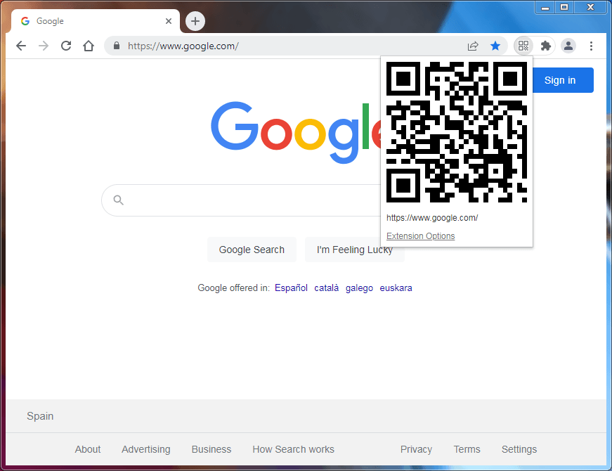

# Url to QR
Chrome Extension

## Installing extension
1. Download the extension from [releases](https://github.com/serrgiofdezz/urltoqr/releases).
2. Extract in a safe place.
3. On your browser, go to `chrome://extensions` and enable **developer mode**.
4. Now tap **load unpacked** and select the folder of the extension you just extracted.

Optionally, go to extensions icon in your toolbar and pin the extension to it for a quicker use.

## Screenshots

## Credits
[Real Chan](realchantestmail@gmail.com) for the original extension.
